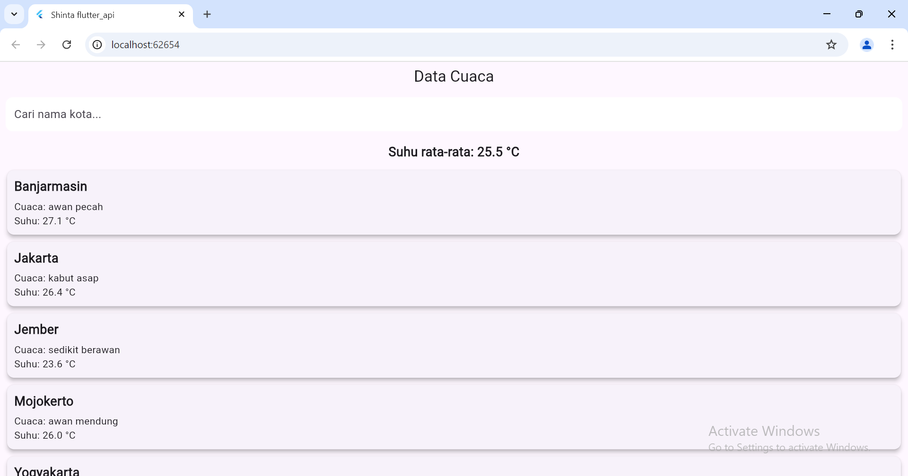

**Tugas Flutter API**
=====================
**Shinta Yulistiana_362358302076_2A TRPL**
=====================
Menggunakan OpenWeather API untuk data cuaca.

Manipulasi data yang ada antara lain:
1. Pencarian nama kota untuk melihat cuaca kota yang dipilih.
2. Menghitung suhu rata-rata dari data cuaca kota yang ada.
3. Mengambil data yang dibutuhkan seperti nama kota, deskripsi cuaca, dan suhu dari **weatherData** dan ditampilkan dalam antarmuka aplikasi flutter.
